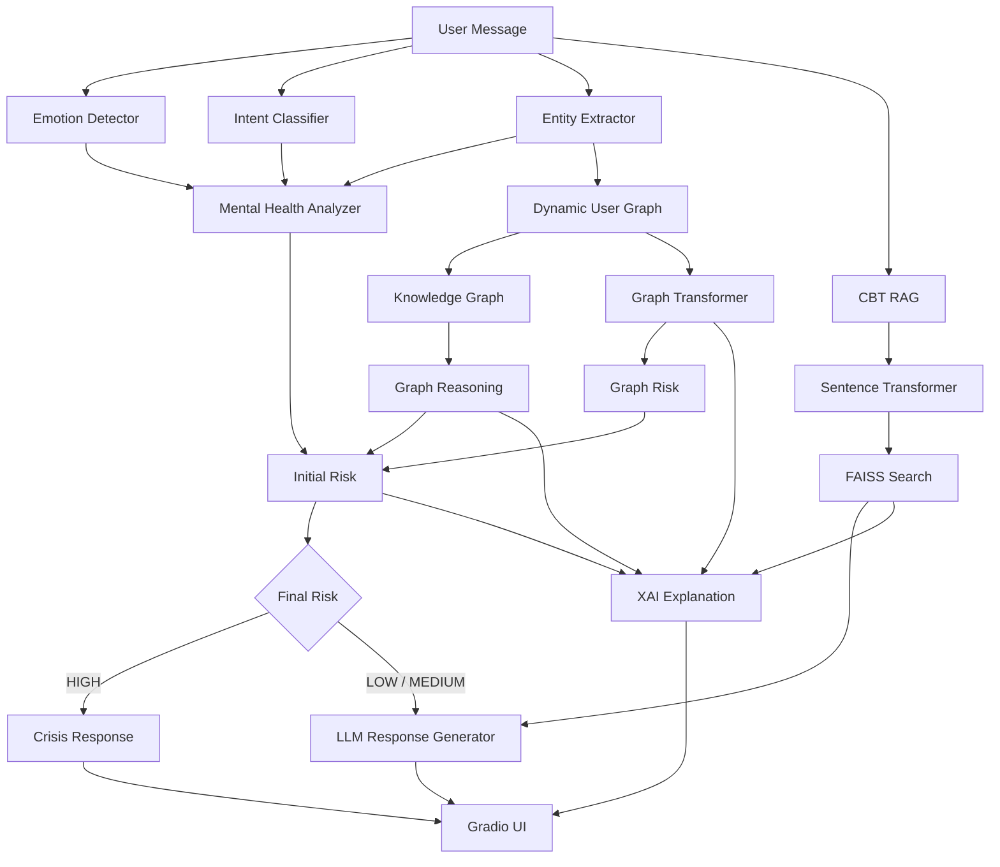

# 💜 Elena — Mental Health Companion

> **An explainable, safety-aware AI mental health companion combining Transformer NLP, Knowledge Graph reasoning, Graph Transformers, CBT-based RAG, LLM response generation, and Explainable AI.**

Elena is an academic/research prototype for mental-health-oriented conversational AI. Instead of relying on a single chatbot model, the system analyzes each message through multiple components — **emotion detection, intent classification, entity extraction, knowledge-graph reasoning, graph-based risk assessment, retrieval-augmented generation, and safety checks** — before generating a response.

The project is implemented primarily as a **Google Colab notebook** that builds the backend modules and launches an interactive **Gradio** interface.

---

## 📌 Table of Contents

- [Overview](#-overview)
- [Key Features](#-key-features)
- [System Architecture](#-system-architecture)
- [How It Works](#-how-it-works)
- [Project Structure](#-project-structure)
- [Core Modules](#-core-modules)
- [Dataset & Preprocessing](#-dataset--preprocessing)
- [Intent Classification](#-intent-classification)
- [Knowledge Graph](#-knowledge-graph)
- [Graph Transformer](#-graph-transformer)
- [CBT RAG](#-cbt-rag)
- [LLM Response Generation](#-llm-response-generation)
- [Risk & Crisis Detection](#-risk--crisis-detection)
- [Explainable AI](#-explainable-ai)
- [Dynamic User Graph](#-dynamic-user-graph)
- [Gradio Interface](#-gradio-interface)
- [Installation](#-installation)
- [Running the Project](#-running-the-project)
- [Model Configuration](#-model-configuration)
- [Evaluation](#-evaluation)
- [Example](#-example)
- [Technology Stack](#-technology-stack)
- [Limitations](#-limitations)
- [Future Work](#-future-work)
- [Safety Disclaimer](#-safety-disclaimer)
- [Academic Context](#-academic-context)
- [License](#-license)

---

# 🧠 Overview

Elena is designed as a **multi-stage conversational AI pipeline** for supportive mental-health conversations.

Given a user's message:

```text
User Message
     ↓
Emotion Detection
     ↓
Intent Classification
     ↓
Mental Health Entity Extraction
     ↓
Risk / Crisis Analysis
     ↓
Knowledge Graph Reasoning
     ↓
Graph Transformer Risk Assessment
     ↓
CBT Knowledge Retrieval
     ↓
LLM Response Generation
     ↓
Explainable Output
     ↓
Gradio Chat Interface
```

For high-risk inputs, the system routes the conversation to a dedicated crisis-response pathway rather than the normal response-generation pathway.

---

# ✨ Key Features

### 🧠 Natural Language Understanding

- Emotion detection using a pretrained DistilBERT model
- Transformer-based intent classification
- Mental-health-focused entity extraction
- Batch analysis support

### 🕸️ Knowledge-Based Reasoning

- Mental-health knowledge graph
- Condition → symptom relationships
- Condition → cause relationships
- Condition → treatment relationships
- Graph-based inference from detected symptoms
- Fuzzy/substring matching for graph entities

### 🤖 Graph Neural Network

- PyTorch Geometric
- `TransformerConv`
- Configurable graph-transformer layers
- Low / Medium / High risk classification

### 📚 Retrieval-Augmented Generation

- CBT knowledge base
- Sentence Transformer embeddings
- FAISS vector similarity search
- Top-k retrieval of relevant CBT techniques

### 🛡️ Safety Layer

- Crisis keyword detection
- Crisis intent detection
- Self-harm behavior detection
- Suicidal-thought entity detection
- Risk-level classification
- Dedicated crisis response

### 🔬 Explainability

The system exposes:

- Final risk level
- Primary emotion
- Detected symptoms
- Graph connections
- Graph Transformer risk
- Retrieved CBT technique
- Intent confidence

### 💬 Interactive UI

- Gradio-based chatbot
- Typing effect
- Conversation history
- New conversation button
- Safety disclaimer
- Debug/error visibility during development

---

# 🏗️ System Architecture



---

# 🔄 How It Works

## 1. User Input

The user enters a message through the Gradio interface.

Example:

```text
I haven't been sleeping properly and I feel exhausted all the time.
```

---

## 2. Emotion Detection

Elena uses:

```text
bhadresh-savani/distilbert-base-uncased-emotion
```

The classifier supports:

```text
sadness
joy
love
anger
fear
surprise
```

The module returns:

```json
{
  "top_emotion": "sadness",
  "confidence": 0.91
}
```

along with probabilities for all supported emotions.

---

## 3. Intent Classification

The intent classifier is initialized from:

```text
distilroberta-base
```

The final classifier used by the analyzer contains:

```text
crisis
help_seeking
general
```

The earlier preprocessing pipeline also supports a `sharing` category while preparing and balancing the broader dataset.

The classifier returns:

```json
{
  "intent": "help_seeking",
  "confidence": 0.87
}
```

---

## 4. Entity Extraction

The entity extractor identifies mental-health-related:

- Symptoms
- Emotions
- Behaviors

Examples include:

```text
Symptoms:
- insomnia
- fatigue
- headache
- panic attacks
- suicidal thoughts

Emotions:
- sad
- anxious
- worried
- lonely
- hopeless
- overwhelmed

Behaviors:
- isolation
- self-harm
- cutting
- avoiding people
- staying in bed
```

It also contains phrase mappings such as:

```text
"can't sleep"       → insomnia
"trouble sleeping"  → insomnia
"racing thoughts"   → overthinking
"no energy"         → fatigue
"feel empty"        → empty
"feel numb"         → numb
```

---

# 🧩 Project Structure

The notebook creates the following project structure:

```text
mental_health_chatbot/
│
├── backend/
│   │
│   ├── data/
│   │   ├── training_data.json
│   │   ├── cbt_knowledge.json
│   │   ├── crisis_keywords.json
│   │   ├── mental_health_kg.json
│   │   ├── knowledge_graph.json
│   │   ├── processed_intent_data.csv
│   │   ├── processed_intent_data.json
│   │   ├── balanced_intent_data.csv
│   │   ├── train_intent_data.csv
│   │   └── test_intent_data.csv
│   │
│   ├── models/
│   │   ├── emotion_detector.py
│   │   ├── intent_classifier.py
│   │   ├── entity_extractor.py
│   │   ├── mental_health_analyzer.py
│   │   ├── graph_transformer.py
│   │   └── intent_classifier_trained/
│   │
│   └── utils/
│       ├── data_loader.py
│       ├── graph_reasoner.py
│       ├── risk_classifier.py
│       ├── rag_module.py
│       ├── explainer.py
│       └── dynamic_graph_builder.py
│
├── README.md
└── Elena_ChatBot.ipynb
```

---

# 🧠 Core Modules

## `emotion_detector.py`

Responsibilities:

- Load pretrained emotion model
- Tokenize user text
- Run Transformer inference
- Return emotion probabilities
- Return primary emotion
- Support batch analysis

Model:

```text
bhadresh-savani/distilbert-base-uncased-emotion
```

---

## `intent_classifier.py`

Responsibilities:

- Fine-tune DistilRoBERTa
- Classify user intent
- Calculate accuracy and weighted F1
- Save/load trained model
- Provide confidence scores
- Run batch predictions

Supported final intent labels:

```text
crisis
help_seeking
general
```

---

## `entity_extractor.py`

Uses spaCy together with domain-specific dictionaries for:

```text
Symptoms
Emotions
Behaviors
```

This provides structured information for the downstream risk and graph components.

---

## `mental_health_analyzer.py`

Acts as the central NLP analysis layer.

It combines:

```text
Emotion Detector
        +
Intent Classifier
        +
Entity Extractor
```

and produces:

```text
emotion
intent
entities
is_crisis
risk_level
```

---

## `data_loader.py`

Provides utilities for loading:

```text
cbt_knowledge.json
crisis_keywords.json
mental_health_kg.json
training_data.json
```

It also provides crisis-keyword checking functionality.

---

# 📊 Dataset & Preprocessing

The project uses several JSON-based resources:

### `training_data.json`

Contains conversational training examples.

### `crisis_keywords.json`

Contains crisis-related phrases and categories.

### `cbt_knowledge.json`

Contains CBT techniques used by the retrieval component.

### `mental_health_kg.json`

Contains the source mental-health knowledge graph information.

---

## Text Cleaning

The preprocessing pipeline:

```text
Raw Text
   ↓
Lowercase
   ↓
Remove non-alphanumeric characters
   ↓
Normalize whitespace
   ↓
Remove duplicates
   ↓
Remove very short samples
```

---

## Class Balancing

The intent dataset is balanced using resampling.

The preprocessing pipeline works with:

```text
crisis
help_seeking
general
sharing
```

during the broader dataset preparation stage.

A later training pipeline filters the classifier training data to:

```text
crisis
help_seeking
general
```

and uses upsampling to balance the available classes.

---

## Train / Validation Split

The final intent-classification training pipeline uses:

```text
80% Training
20% Validation
```

with stratification to preserve class distribution.

---

# 🎯 Intent Classification

The classifier uses:

```text
DistilRoBERTa
```

with:

```text
max_length = 128
learning_rate = 3e-5
epochs = 5
train_batch_size = 16
evaluation_batch_size = 8
gradient_accumulation_steps = 2
weight_decay = 0.05
warmup_steps = 50
```

Additional training features:

- Early stopping
- Best-model loading based on F1
- FP16 when CUDA is available
- Model checkpoint saving
- Accuracy calculation
- Weighted F1 calculation
- Classification report
- Confusion matrix

The project also explicitly calculates **crisis recall** as an important safety-oriented evaluation metric.

---

# 🕸️ Knowledge Graph

The source knowledge graph is stored in:

```text
mental_health_kg.json
```

It is converted into a structured graph:

```text
Condition
 ├── has_symptom → Symptom
 ├── has_cause   → Cause
 └── treated_by  → Treatment
```

The generated graph is stored as:

```text
knowledge_graph.json
```

with:

```json
{
  "entities": [],
  "relations": []
}
```

NetworkX is then used to construct a directed graph.

---

# 🔎 Graph Reasoning

The graph reasoning component looks for relationships between detected user entities and knowledge-graph nodes.

It supports:

- Exact matching
- Substring matching
- Word-overlap matching
- Neighbor expansion
- Risk-indicator extraction

Example conceptual reasoning:

```text
User Entity
    ↓
Knowledge Graph Node
    ↓
Related Neighbor
    ↓
Risk Indicator
```

Example:

```text
insomnia
   ↓
related condition
   ↓
associated symptoms / causes
```

---

# 🤖 Graph Transformer

The project implements a Graph Transformer using:

```python
from torch_geometric.nn import TransformerConv
```

The model contains configurable:

```text
Number of layers
Hidden dimension
Attention heads
Input node features
```

The classifier outputs three risk categories:

```text
LOW
MEDIUM
HIGH
```

Conceptually:

```text
Node Features
      ↓
TransformerConv
      ↓
ReLU
      ↓
TransformerConv
      ↓
ReLU
      ↓
Risk Classifier
      ↓
Low / Medium / High
```

The project also contains a lightweight graph construction function that converts detected nodes into PyTorch Geometric graph data.

> **Research note:** the current notebook uses generated/simple node features for the Graph Transformer rather than a fully trained graph model on a large labeled graph dataset. This is an important distinction when presenting the project academically.

---

# 📚 CBT RAG

The retrieval module is implemented using:

```text
Sentence Transformers
+
FAISS
```

The embedding model is:

```text
all-MiniLM-L6-v2
```

Pipeline:

```text
CBT Knowledge Base
        ↓
Sentence Transformer
        ↓
Text Embeddings
        ↓
FAISS Index
        ↓
User Query Embedding
        ↓
Similarity Search
        ↓
Top-k CBT Technique
```

The current response pipeline retrieves:

```python
cbt_rag.retrieve(user_input, k=1)
```

before passing the retrieved knowledge to the response generator.

---

# 🤖 LLM Response Generation

The project includes an LLM response-generation component:

```text
backend/models/llm_generator.py
```

The response generator receives:

```text
User Input
+
NLP Analysis
+
Retrieved CBT Knowledge
+
Final Risk Level
```

and generates the normal supportive response when the risk level is not high.

For high-risk inputs, the system bypasses the normal response generator and uses the dedicated crisis-response function.

---

# 🚨 Risk & Crisis Detection

Safety is implemented through multiple signals.

## Crisis Intent

A message can be classified as:

```text
crisis
```

with a confidence threshold.

The analyzer uses a crisis confidence threshold of:

```text
> 0.60
```

---

## Crisis Keywords

The analyzer checks phrases such as:

```text
kill myself
suicide
end it all
want to die
suicidal
overdose
jump off
end my life
better off dead
not worth living
```

---

## Crisis Entities

The following can also trigger crisis detection:

```text
suicidal thoughts
```

and self-harm behaviors such as:

```text
cutting
self-harm
hurting myself
```

---

## Risk Levels

The analyzer produces:

```text
LOW
MEDIUM
HIGH
```

High risk is triggered when the crisis pathway is activated.

Medium risk can be associated with physical symptoms such as:

```text
headache
muscle tension
fatigue
insomnia
heart racing
shortness of breath
```

and indicators such as:

```text
depressed
hopeless
worthless
cannot go on
overwhelming
unbearable
giving up
```

The final chatbot logic also incorporates Graph Transformer and graph-reasoning signals.

---

# 🧮 Final Risk Decision

The chatbot combines the analyzer result with graph-based signals.

Conceptually:

```text
Initial Analyzer Risk
        +
Graph Transformer Risk
        +
Graph Reasoning Indicators
        ↓
Final Risk
```

The current integration logic elevates the final risk when:

```text
Graph Transformer = HIGH
OR
multiple graph risk indicators are found
```

and similarly considers medium-risk graph signals.

---

# 🔬 Explainable AI

The project contains an explainability layer that converts model outputs into a human-readable explanation.

The final chatbot explanation contains:

```text
Risk Level
Primary Emotion
Key Symptoms
Graph Connections
Graph Transformer Risk
Knowledge Used
Intent Confidence
```

Example:

```text
Risk Level: MEDIUM
Primary Emotion: sadness
Key Symptoms: insomnia, fatigue
Graph Connections: stress → insomnia
Graph Transformer Risk: MEDIUM
Knowledge Used: Cognitive restructuring
```

The project also contains an `explainer.py` module with explanation-oriented functionality and imports for explainability tooling.

---

# 🕸️ Dynamic User Graph

The project contains:

```text
dynamic_graph_builder.py
```

which is intended to construct a personalized graph from:

```text
User Symptoms
+
User Emotions
+
Base Knowledge Graph
```

Supported node types include:

```text
symptom
emotion
behavior
condition
```

The graph can then be represented using PyTorch Geometric data structures.

---

# 💬 Gradio Interface

The final UI is built with **Gradio**.

Application title:

```text
Elena — Mental Health Companion
```

The interface includes:

- Chat window
- Message textbox
- Send button
- New Conversation button
- Typing animation
- Conversation memory
- Reasoning information
- Safety disclaimer

The UI uses a purple/violet visual theme.

The notebook launches the application using:

```python
demo.launch(
    share=True,
    debug=True,
    show_error=True
)
```

---

# ⚙️ Installation

The original project was developed in **Google Colab**.

## 1. Clone the Repository

```bash
git clone <YOUR_REPOSITORY_URL>
cd mental_health_chatbot
```

---

## 2. Create a Virtual Environment

### Windows

```bash
python -m venv venv
venv\Scripts\activate
```

### Linux / macOS

```bash
python3 -m venv venv
source venv/bin/activate
```

---

## 3. Install Dependencies

The notebook installs:

```bash
pip install torch torchvision torchaudio
pip install torch-geometric
pip install transformers
pip install spacy
pip install faiss-cpu
pip install sentence-transformers
pip install gradio
pip install lime
```

The notebook also uses packages including:

```text
numpy
pandas
scikit-learn
datasets
tqdm
networkx
```

Install them if they are not already available:

```bash
pip install numpy pandas scikit-learn datasets tqdm networkx
```

---

## 4. Download spaCy Model

```bash
python -m spacy download en_core_web_sm
```

---

# ▶️ Running the Project

The current implementation is notebook-first.

Open:

```text
ANLP_ChatBot(Project)FinalBossFightWin.ipynb
```

in Google Colab or another compatible Jupyter environment.

### Recommended execution order

```text
1. Install dependencies
        ↓
2. Download spaCy model
        ↓
3. Create backend directories
        ↓
4. Upload required JSON datasets
        ↓
5. Build knowledge graph
        ↓
6. Prepare intent dataset
        ↓
7. Balance intent classes
        ↓
8. Split training/validation data
        ↓
9. Train DistilRoBERTa intent classifier
        ↓
10. Evaluate classifier
        ↓
11. Save trained classifier
        ↓
12. Initialize emotion detector
        ↓
13. Initialize entity extractor
        ↓
14. Initialize graph reasoning
        ↓
15. Initialize Graph Transformer
        ↓
16. Initialize CBT RAG
        ↓
17. Initialize LLM response generator
        ↓
18. Initialize XAI
        ↓
19. Launch Elena with Gradio
```

---

# 📦 Required Data Files

The notebook expects the following files under:

```text
mental_health_chatbot/backend/data/
```

```text
training_data.json
cbt_knowledge.json
crisis_keywords.json
mental_health_kg.json
```

The notebook generates additional processed files:

```text
processed_intent_data.csv
processed_intent_data.json
balanced_intent_data.csv
train_intent_data.csv
test_intent_data.csv
knowledge_graph.json
```

---

# 🖥️ GPU Support

The notebook checks CUDA availability:

```python
torch.cuda.is_available()
```

and reports the GPU:

```python
torch.cuda.get_device_name(0)
```

The intent classifier automatically selects:

```text
CUDA
```

when available and otherwise uses:

```text
CPU
```

FP16 training is enabled when CUDA is available.

A CUDA-enabled environment such as Google Colab can therefore be used for model training.

---

# 🧪 Evaluation

The intent-classification pipeline evaluates the model using:

### Accuracy

```text
Accuracy
```

### Weighted F1

```text
Weighted F1-score
```

### Classification Report

The notebook generates a class-level classification report.

### Confusion Matrix

The notebook generates a confusion matrix for:

```text
crisis
help_seeking
general
```

### Crisis Recall

The project explicitly calculates:

```text
Crisis Recall
```

because correctly identifying crisis examples is a critical safety-oriented metric.

The notebook warns when:

```text
Crisis Recall < 0.85
```

---

# 🧪 Smoke Tests

The notebook includes test messages such as:

```text
"I want to end everything, I can't take this anymore"

"Can you help me find a therapist? I'm struggling badly"

"Today was okay, just wanted to chat a bit"
```

These are used to check whether the intent classifier produces the expected broad categories:

```text
CRISIS
HELP_SEEKING
GENERAL
```

---

# 💡 Example End-to-End Flow

### Input

```text
I haven't been sleeping for days and I feel exhausted.
```

### 1. Emotion Detection

```text
Primary emotion → sadness / related emotional class
```

### 2. Entity Extraction

```text
insomnia
fatigue
```

### 3. Intent Classification

```text
help_seeking / general
```

### 4. Graph Reasoning

The extracted entities are matched against the mental-health knowledge graph.

### 5. Graph Transformer

The graph representation is passed through the Graph Transformer.

### 6. CBT Retrieval

FAISS retrieves a relevant CBT technique.

### 7. Risk Decision

The analyzer and graph signals contribute to the final risk level.

### 8. Response

If the final risk is not high:

```text
LLM Response Generator
```

is used.

If the final risk is high:

```text
Dedicated Crisis Response
```

is returned.

### 9. Explanation

The response is accompanied by an interpretable reasoning summary.

---

# 🧰 Technology Stack

| Layer | Technology |
|---|---|
| Programming Language | Python |
| Deep Learning | PyTorch |
| NLP | Hugging Face Transformers |
| Emotion Detection | DistilBERT |
| Intent Classification | DistilRoBERTa |
| Entity Processing | spaCy |
| Embeddings | Sentence Transformers |
| Vector Search | FAISS |
| Knowledge Graph | NetworkX |
| Graph Deep Learning | PyTorch Geometric |
| Graph Attention | TransformerConv |
| RAG | CBT Knowledge + FAISS |
| Explainability | SHAP / LIME-oriented components |
| UI | Gradio |
| Dataset Processing | Pandas / NumPy |
| ML Evaluation | scikit-learn |
| Development Environment | Google Colab / Jupyter |

---

# 🔐 Privacy & Data

The project is an academic prototype and should not be assumed to provide production-grade privacy guarantees.

If deployed with real users:

- Avoid storing unnecessary sensitive conversations.
- Implement proper access control.
- Encrypt sensitive data.
- Define data-retention policies.
- Remove personally identifiable information where possible.
- Obtain appropriate consent.
- Conduct security and privacy reviews.

---

# ⚠️ Limitations

This project should be understood as a **research/academic prototype**, not as a medical diagnostic or treatment system.

Current limitations include:

### Dataset Size

The intent classifier depends on the available training examples and balancing strategy.

### Rule-Based Entity Extraction

The entity extractor uses domain-specific dictionaries and phrase matching, so it may miss semantically equivalent expressions.

### Keyword-Based Crisis Detection

Keyword detection cannot guarantee that every crisis expression will be identified.

### Graph Transformer

The current notebook demonstrates the Graph Transformer architecture and integration, but its graph features are simplified and should not be interpreted as evidence of a clinically validated graph-risk model.

### RAG Coverage

CBT responses depend on the quality and coverage of `cbt_knowledge.json`.

### LLM Reliability

Generated responses can contain errors and must not be treated as professional clinical advice.

### No Clinical Validation

The system has not been clinically validated and should not be used for diagnosis, treatment decisions, or emergency triage.

---

# 🚀 Future Work

Possible research and engineering extensions include:

- Train the Graph Transformer on a larger labeled graph dataset
- Replace simplified graph features with learned semantic node embeddings
- Improve entity extraction using a fine-tuned NER model
- Expand the intent taxonomy
- Add multilingual mental-health support
- Improve semantic crisis detection
- Add dedicated safety classifiers
- Evaluate false-negative crisis cases more extensively
- Improve CBT retrieval with hybrid semantic + lexical search
- Add retrieval evaluation metrics
- Add conversation-level risk tracking
- Improve privacy-preserving conversation memory
- Add automated model monitoring
- Add unit and integration tests
- Add REST API support
- Add Docker deployment
- Add authentication and authorization
- Add production-grade logging and observability
- Add human-in-the-loop safety review

---

# 🎓 Academic / Research Value

The project demonstrates how multiple AI paradigms can be combined into a single conversational system:

```text
Transformer NLP
       +
Knowledge Graphs
       +
Graph Neural Networks
       +
Retrieval-Augmented Generation
       +
LLM Response Generation
       +
Explainable AI
       +
Safety-Aware Processing
```

The architecture is particularly useful for studying:

- Explainable conversational AI
- NLP-based mental-health analysis
- Knowledge-enhanced NLP
- Graph-based reasoning
- Retrieval-Augmented Generation
- Safety-aware AI systems
- Multi-stage AI decision pipelines

---

# 🗂️ Notebook

The main implementation notebook is:

```text
ANLP_ChatBot(Project)FinalBossFightWin.ipynb
```

The notebook automatically creates the backend modules and data-processing pipeline.

For a cleaner production repository, the generated Python modules should eventually be committed directly rather than requiring users to execute every notebook cell.

---

# 🤝 Contributing

Contributions are welcome for research and engineering improvements.

A typical contribution workflow:

```bash
git checkout -b feature/your-feature
```

Make your changes, test them, then:

```bash
git add .
git commit -m "Add your feature"
git push origin feature/your-feature
```

Open a pull request describing:

- What changed
- Why it changed
- How it was tested
- Any limitations or safety considerations

---

# 📜 License

No license is currently specified by the project notebook.

Before publishing the repository, choose and add an appropriate open-source license, for example:

```text
MIT License
```

Also review the individual licenses and usage terms of all pretrained models, datasets, libraries, and external resources used by the project.

---

# 🛡️ Safety Disclaimer

> **Elena is not a substitute for a licensed mental-health professional, medical provider, or emergency service.**

The system is an experimental research prototype. Automated risk detection can produce false positives and false negatives.

For real-world deployment, crisis-response content, emergency numbers, privacy practices, model behavior, and safety policies should be reviewed and validated by qualified professionals for the target country and deployment environment.

If someone is in immediate danger, they should contact their local emergency service or an appropriate crisis service rather than relying on this application.

---

# 💜 Elena

**An experimental AI mental health companion combining NLP, knowledge graphs, graph transformers, RAG, LLMs, safety analysis, and explainability.**

Built as an academic/research project with the goal of exploring more transparent and safety-aware conversational AI.
